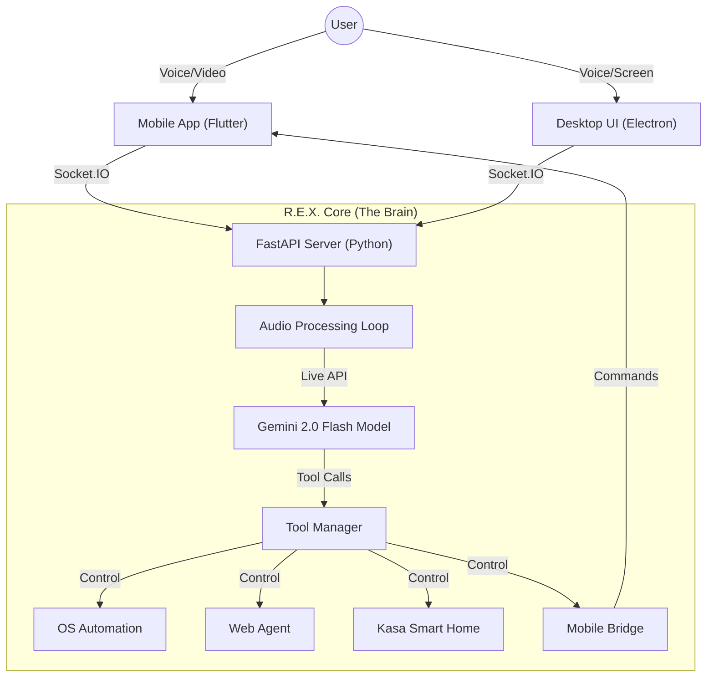

# R.E.X. (Realtime Experience & Execution) V2

**Advanced System Intelligence, Reimagined.**


> **"A digital extension of your will."**

R.E.X. V2 is a **Multimodal AI Agent operating system** that bridges the gap between your digital workstation, your smart home, and the physical world. Unlike traditional chatbots that are confined to a text box, R.E.X. lives alongside you—seeing your screen, hearing your environment, and actively controlling devices to execute complex workflows.

Powered by **Google Gemini 2.0 Flash Multimodal Live API**, R.E.X. achieves sub-300ms latency for voice interactions, allowing for natural, "barge-in" conversations that feel truly human.

---

## 🏗️ System Architecture

R.E.X. is built on a modular, event-driven "Brain-Body-Limb" architecture designed for speed and extensibility.

### 🧠 The Brain (Backend)
*   **Core:** Python 3.10+ / FastAPI / AsyncIO
*   **Intelligence:** Google GenAI SDK (Gemini 2.0 Flash)
*   **Audio Pipeline:** PyAudio + UDP Streaming for <100ms latency.
*   **Tool Dispatcher:** Dynamic function calling that routes intent to OS Automation, Web Agents, or Hardware Control.

### 🧘 The Body (Frontend)
*   **Framework:** Electron + React + Vite
*   **Design System:** Custom "Holographic Glass" UI with TailwindCSS.
*   **Visualizer:** Real-time WebGL audio visualization that reacts to both user input and AI thought.

### ✋ The Limb (Mobile Companion)
*   **Framework:** Flutter (Android)
*   **Connectivity:** Socket.IO + WebRTC for real-time video/audio streaming.
*   **Capabilities:** Background Service, Telephony Manager, Hardware Bridge (Sensors, Camera).



---

## 🚀 Key Capabilities

### 1. Multimodal Perception & Interaction
R.E.X. doesn't just read text; it experiences the world.
*   **Screen Sight:** "Look at this error code." R.E.X. captures your screen, analyzes the visual context, and provides a fix.
*   **Mobile Eye:** "What part is this?" Stream your phone's camera to R.E.X. for real-world object analysis.
*   **Barge-In:** Interrupt R.E.X. mid-sentence to correct or redirect it, just like a real conversation.

### 2. The R.E.X. Companion App (Android)
A fully native extension of the AI.
*   **Secretary Mode:** R.E.X. screens incoming calls. It speaks to the caller, takes a message, and notifies you only if urgent.
*   **Universal Clipboard:** Copy on Desktop ⮕ Paste on Phone (and vice-versa) instantly.
*   **Telepresence:** Two-way audio allows you to talk to your home (and control your PC) from anywhere.
*   **File Beam:** Select a file on your phone -> "Beam to PC" -> It appears on your desktop instantly.

### 3. Deep OS Integration
*   **Window Management:** "Snap this window to the right and open VS Code on the left."
*   **App Control:** Volume, Brightness, Media Playback, and Application launching.
*   **Workflow Automation:** Complex multi-step actions like "Organize my downloads folder by date."

### 4. Smart Home & IoT
*   **TP-Link Kasa:** Native control for smart plugs and bulbs. "Set the studio to focused Blue."
*   **3D Printing:** Integrated with OctoPrint/Moonraker to monitor prints and detect failures via vision.

### 5. Security & Pentesting
*   **Kali Linux Compatible:** Native shell execution (Bash/PowerShell).
*   **Network Tools:** Nmap scanning, Whois lookups, and Netstat monitoring.
*   **Security Agent:** Dedicated module for security auditing and recon.

### 5. Autonomous Web Agents
*   **Research:** "Find the top 5 emerging trends in AI agents." R.E.X. browses the web, synthesizes data, and creates a report.
*   **Scraping:** Extract structured data tables from websites into Excel files automatically.

---

## 🛠️ Technology Stack

| Component | Technology | Version | Usage |
| :--- | :--- | :--- | :--- |
| **LLM** | Google Gemini 2.0 | `2.0-flash-exp` | Core Reasoning & Vision |
| **Backend** | Python | `3.10` | Server Logic |
| **API** | FastAPI | `0.109` | REST & WebSocket |
| **Frontend** | React + Electron | `18` / `28` | Desktop GUI |
| **Mobile** | Flutter | `3.27` | Android Companion |
| **Comms** | Socket.IO | `4.6` | Realtime Events |
| **Vision** | OpenCV + MSS | `4.9` | Screen Capture |

---

## � Installation

### Prerequisites
*   **Windows 10/11** or **Linux** (Kali Linux Fully Supported)
*   **Python 3.10+**
*   **Node.js 18+**
*   **Android Device** (Android 10+)
*   **Gemini API Key** (from [Google AI Studio](https://aistudio.google.com/))

### Part 1: The Brain (Server)
1.  Clone the repository:
    ```bash
    git clone https://github.com/RushabhMakim3880/Assistant-Rex-V2.git
    cd Assistant-Rex-V2
    ```
2.  Set up Python environment:
    ```bash
    python -m venv venv
    .\venv\Scripts\activate
    pip install -r requirements.txt
    ```
3.  Configure API Key:
    *   Rename `.env.example` to `.env`
    *   Add your key: `GEMINI_API_KEY=your_key_here`

### Part 2: The Body (Desktop UI)
1.  Install dependencies:
    ```bash
    npm install
    ```
2.  Run the Development Server:
    ```bash
    npm run dev
    ```
    *This launches both the Python backend and the Electron window.*

### Part 3: The Limb (Mobile)
1.  Navigate to the mobile directory:
    ```bash
    cd rex_companion
    ```
2.  Connect your Android device via USB and run:
    ```bash
    flutter run --release
    ```

---

## � Future Roadmap (Phase 5)

*   [ ] **Neural Memory:** Implementation of a Vector Database (Pinecone/Chroma) for indefinite context retention.
*   [ ] **Local Fallback:** Integration of Llama 3 (via Ollama) for offline functionality.
*   [ ] **Swarm Mode:** Ability for multiple R.E.X. instances (e.g., Home & Office) to share context.
*   [ ] **Holographic Hardware:** Porting the visualizer to standalone hardware (e.g., Looking Glass Portrait).

---

## 🤝 Contributing

Contributions are welcome! Please open an issue first to discuss what you would like to change.
1.  Fork the Project
2.  Create your Feature Branch (`git checkout -b feature/AmazingFeature`)
3.  Commit your Changes (`git commit -m 'Add some AmazingFeature'`)
4.  Push to the Branch (`git push origin feature/AmazingFeature`)
5.  Open a Pull Request

---

## 📄 License

Distributed under the MIT License. See `LICENSE` for more information.

---

**Developed with ❤️ by Rushabh Makim**
